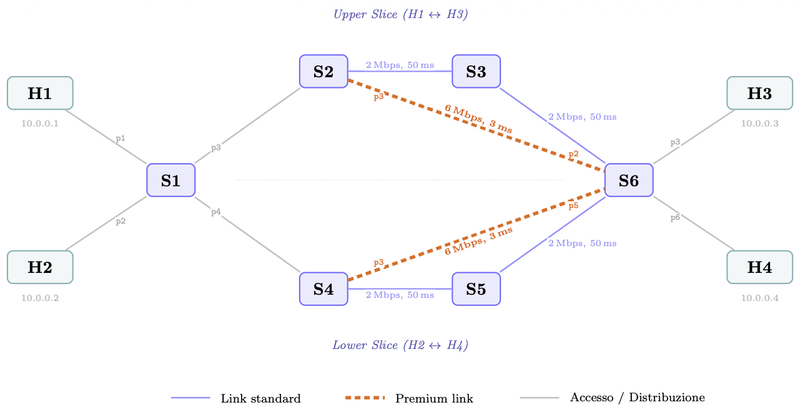

# SDN Network Slicing with Ryu and Mininet

University project for the Networks and Cloud Infrastructures course (Federico II).
Implements a Network Slicing system on SDN using the Ryu controller and Mininet, with Premium Links and Video Preemption.

The project is split into three progressive phases: topology-level isolation, traffic differentiation over premium paths, and dynamic allocation with preemption when video traffic arrives.

A full write-up is available in [`Documentazione_Network_Slicing_with_Ryu_and_Mininet.pdf`](./Documentazione_Network_Slicing_with_Ryu_and_Mininet.pdf).

## Topology



6 OpenFlow switches (S1–S6), 4 hosts (H1–H4). Premium Links are S2→S6 and S4→S6, reserved for video traffic (UDP port 9999).

### Port Mapping

| Switch | Port 1 | Port 2 | Port 3 | Port 4 | Port 5 | Port 6 |
|--------|--------|--------|--------|--------|--------|--------|
| S1 | H1 | H2 | S2 (Upper) | S4 (Lower) | - | - |
| S2 | S1 | S3 (Standard) | S6 (Premium) | - | - | - |
| S3 | S2 | S6 | - | - | - | - |
| S4 | S1 | S5 (Standard) | S6 (Premium) | - | - | - |
| S5 | S4 | S6 | - | - | - | - |
| S6 | S3 (Std Upper) | S2 (Prem Upper) | H3 | S5 (Std Lower) | S4 (Prem Lower) | H4 |

## Requirements

```bash
sudo apt install mininet openvswitch-switch python3-pip iperf
pip3 install ryu
```

## Usage

Each phase requires two terminals: one for the Ryu controller and one for the Mininet topology.
Always start the controller **before** the topology.

### Phase 1 – Topology Slicing

Only H1↔H3 and H2↔H4 can communicate (upper/lower slice). Everything else is blocked.

```bash
# terminal 1
ryu-manager topology_slicing_controller.py

# terminal 2
sudo python3 topology.py

# in mininet: pingall should give 4/12 (33%)
```

### Phase 2 – Service Slicing

All hosts can reach each other. UDP 9999 traffic goes through Premium Links, everything else uses the standard path.

```bash
ryu-manager service_slicing_controller.py
sudo python3 topology.py

# video traffic test (Premium Link)
mininet> H3 iperf -s -u -p 9999 &
mininet> H1 iperf -c 10.0.0.3 -u -p 9999 -b 10M -t 10
# expected: ~5-6 Mbps

# normal traffic test (Standard path)
mininet> H3 iperf -s -u -p 5001 &
mininet> H1 iperf -c 10.0.0.3 -u -p 5001 -b 10M -t 10
# expected: ~1.5-2 Mbps
```

### Phase 3 – Dynamic Slicing with Video Preemption

When the Premium Link is underutilized, normal traffic (UDP 800) can use it.
As soon as video traffic arrives, normal flows are evicted automatically.

```bash
ryu-manager dynamic_slicing_controller.py
sudo python3 topology.py

# start normal traffic on premium link
mininet> H3 iperf -s -u -p 800 &
mininet> H1 iperf -c 10.0.0.3 -u -p 800 -b 1M -t 60 &

# after ~15 seconds, start video: preemption kicks in
mininet> H1 iperf -c 10.0.0.3 -u -p 9999 -b 4M -t 20
```

The controller log shows `[PREEMPTION] Traffico dinamico RIMOSSO da Premium Link` when preemption fires.

## Dynamic Slicing Parameters

| Parameter | Value |
|-----------|-------|
| Premium Link capacity | 6 Mbps |
| Dynamic allocation threshold | 30% |
| Preemption threshold | 80% |
| Monitoring interval | 5 sec |
| Dynamic check interval | 2 sec |

## Monitoring (Grafana)

```bash
cd monitoring
docker-compose up -d
# dashboard at http://localhost:3000 (admin/admin)
```

Shows Premium Link throughput, video status, preemption events and per-port statistics.

## Automated Tests

```bash
sudo python3 scripts/run_tests.py              # all tests
sudo python3 scripts/run_tests.py --test topology
sudo python3 scripts/run_tests.py --test service
sudo python3 scripts/run_tests.py --test dynamic
sudo python3 scripts/run_tests.py --duration 20
```

Results are saved in `test_results/`.

## Troubleshooting

**Controller not connecting**: `sudo systemctl restart openvswitch-switch`

**Mininet won't start**: run `sudo mn -c` to clean up, then retry.

**Stats not updating**: make sure the controller is running before starting Mininet.
